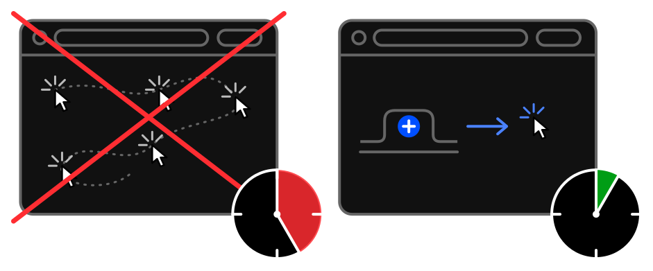

# Saves time

No typing addresses, clicking through the browser's menus or digging through folders on the bookmarks bar.
Open a new tab and it is one click on the link you can see.

History? Move the mouse to the right edge of the screen and a list of recently closed tabs rolls out.

And did we mention that all the links in a subgroup can be opened with one click too - even into a tab group?
