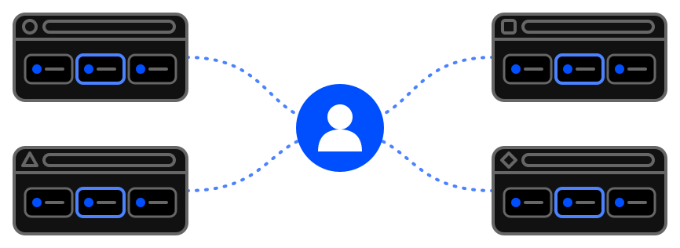

# One account connects them all

Saved a link in Chrome, and Google's sync only brings it to your other Chrome - but you would like it in Brave too?

No problem - that is one of the reasons this extension was made.

It is called a "Chrome extension", but the truth is that most of today's popular browsers support the format.
