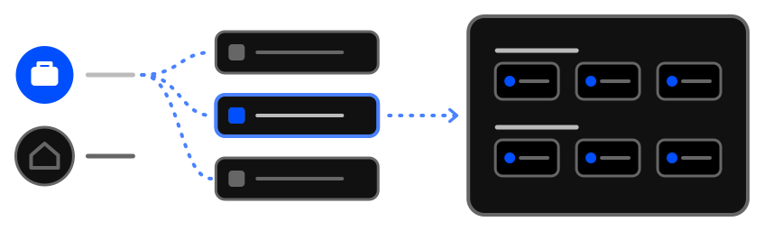

# Organising your content

Your work and content in this extension can be organised further with workspaces and profiles.

The tips explain the idea behind them, with examples of how to use them:

- [Workspaces](../../tips/en/discover-workspaces.md)
- [Profiles](../../tips/en/discover-profiles.md)

And how about organising the pages you open into tab groups?

- [Open a subgroup's links in a tab group](../../tips/en/subgroup-links-into-tab-group.md)
