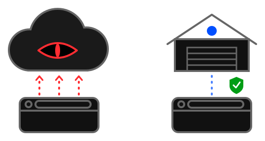

# Life without big corporations

Do you use alternative software that does not require an account with one of the big tech companies
and their questionable practices around user data, tracking and terms of use?

You do not have to give up the comfort and features that come with surrendering to the cloud of
some Mordor - which is one of the reasons apps like this one are born in freelancers' garages.
