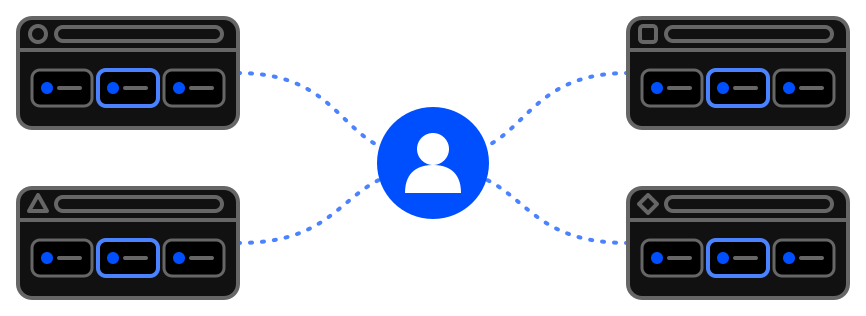

# Jeden účet, prepája všetky

Uložili ste si nejaký odkaz v Chrome a cez Google synchronizáciu ho nájdete len v druhom Chrome ale chceli by ste ho aj napríklad v Brave ? 

Nie je problém, aj preto bolo toto rozšírenie stvorené.

Hovorí sa tomu síce "Chrome rozšírenie" ale pravda je že tento formát dnes podporuje veľká časť najpoužívanejších prehliadačov. 
