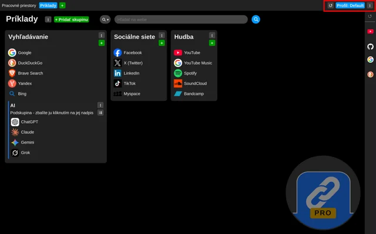

# Discover profiles

The idea behind adding "Profiles" functionality is something like give the user possibility to switch "his role" 
without need to switch to another account what is common solution in given cases.  

Imagine You use Your computer both at work and at home. Then You may want have two profiles, 
one for work related things and second for Your personal life.

Imagine example setup like this:

- Profile: Work
   
  Workspaces: "Development environment", "Testing", "Production", "Customer 1", "Customer 2", ....
- Profile: Home
   
  Workspaces: "Development", "Garage", "Band", "Fishing", ...

You can see the current profile at the top right of the new tab:

Click it to switch between profiles. The same menu also lets you create, export, import and
manage profiles:

Learn more about concept of workspaces: [Discover workspaces](discover-workspaces.md)
