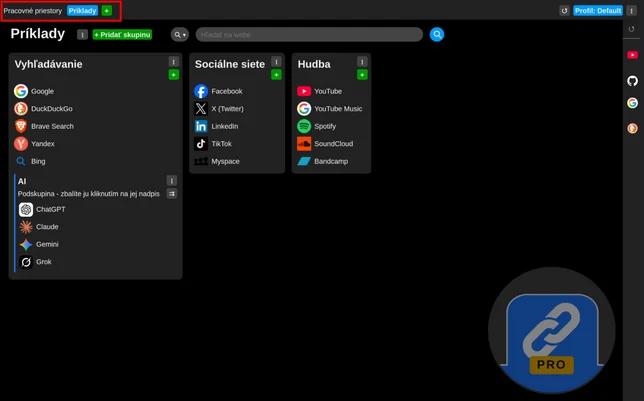

# Discover workspaces

Discover and start to use workspaces.

The idea behind workspace is something like "General topic" or supergroup for current internet session or continous block of it.

Imagine You have a multiple hobbies and interests like for example:
- Vintage cars & motorcycles
- Music / Band
- Software development

Then You can create workspaces like "Garage", "Music", "Development" and there You may have groups and subgroups like:

Garage:
- Parts sellers
- Veteran clubs
- Forums
- Vehicle 1
  - Electric schematics
  - Carburetors setups & advices
  - Igniton setup tips

Band:
- Concerts
- Clubs
- Interesting bands

Development:
- Search & AI tools
- Servers & Apps
- Hostings & Domain registrators
- Utilities
- Git repos

Learn more about concept of profiles too: [Discover profiles](discover-profiles.md)
