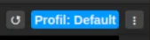
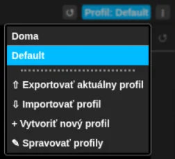

# Objavte profily

Profily vám umožňujú prepnúť „svoju rolu“ bez toho, aby ste sa museli prepnúť do iného účtu, čo je
v takých prípadoch bežné riešenie.

Predstavte si, že svoj počítač používate v práci aj doma. Vtedy sa vám môžu hodiť dva profily -
jeden na pracovné veci a druhý na súkromný život.

Príklad takého nastavenia:

- Profil: Práca
   
  Pracovné priestory: „Vývojové prostredie“, „Testovanie“, „Produkcia“, „Zákazník 1“, „Zákazník 2“, ...
- Profil: Doma
   
  Pracovné priestory: „Vývoj“, „Garáž“, „Kapela“, „Rybárčenie“, ...

Aktuálny profil vidíte vpravo hore na novej karte:

Kliknutím naň sa medzi profilmi prepnete. V tom istom menu profil aj vytvoríte, exportujete,
importujete či spravujete:

Viac o pracovných priestoroch: [Objavte pracovné priestory](discover-workspaces.md)
