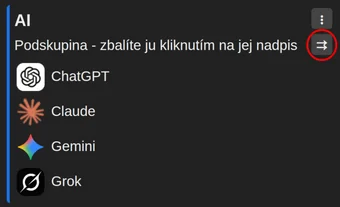

# Otvoriť všetky odkazy v podskupine naraz

Všetky odkazy v podskupine sa dajú otvoriť naraz – tlačidlom s dvojitou šípkou pri názve a popise podskupiny. Otvoria sa v novej skupine kariet.

Ponuka podskupiny (ikona troch bodiek) ponúka aj možnosť „Otvoriť všetky odkazy v skupine samostatných kariet“.

Alebo je možné nastaviť aj zachytávanie stránok do skupiny kariet automaticky: [Zachytávanie odkazov z podskupiny do skupiny kariet](subgroup-links-into-tab-group.md)
