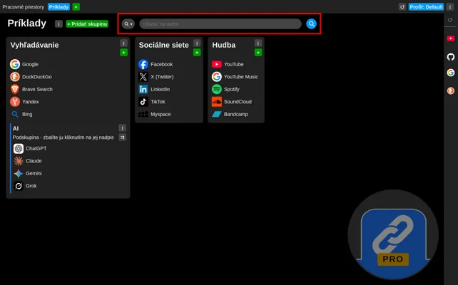
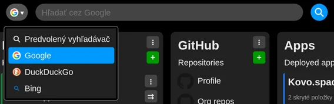

# Vyhľadávanie cez vyhľadávací riadok

V predvolenom nastavení vyhľadávací riadok používa vyhľadávač vášho prehliadača.

Ak chcete použiť iný podporovaný vyhľadávač (Google, DuckDuckGo alebo Bing), jednoducho si ho vyberte z ponuky vedľa vyhľadávacieho riadka.

Toto nastavenie sa nesynchronizuje; pamätá sa iba v prehliadači, v ktorom ste ho nastavili.
